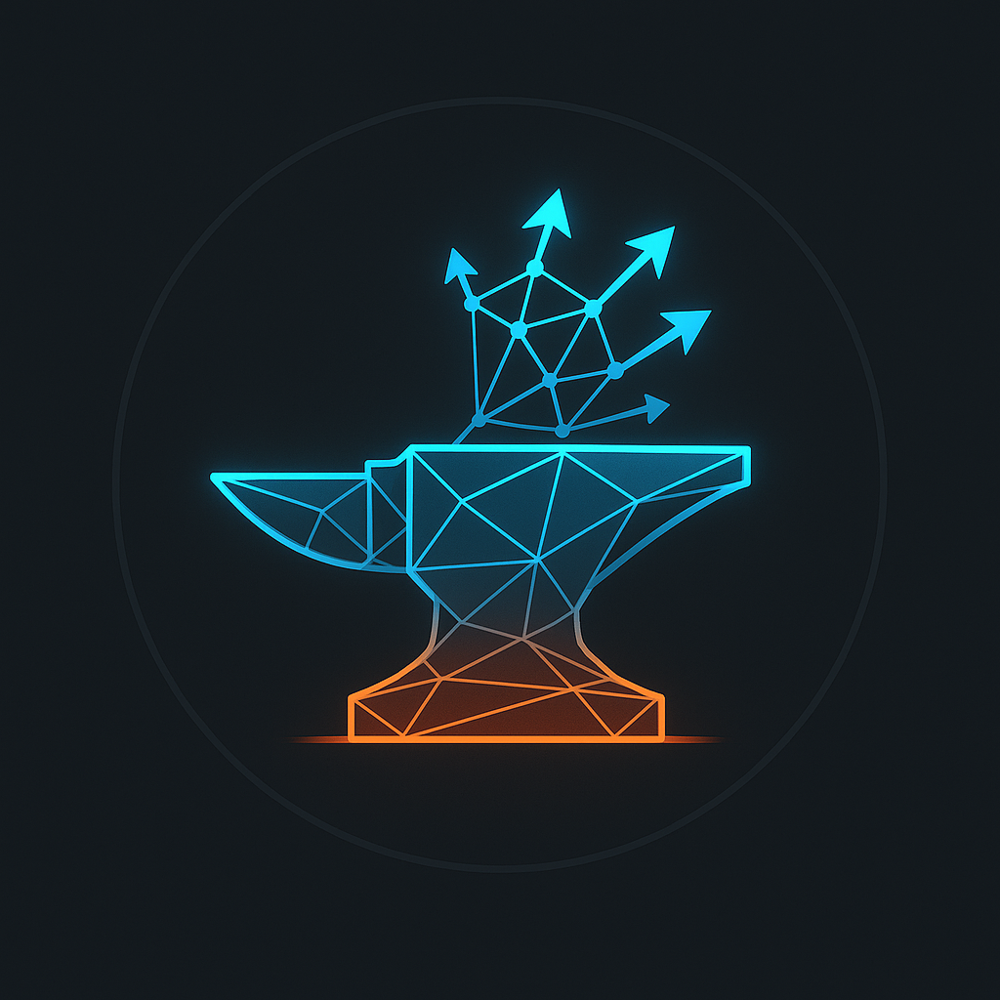
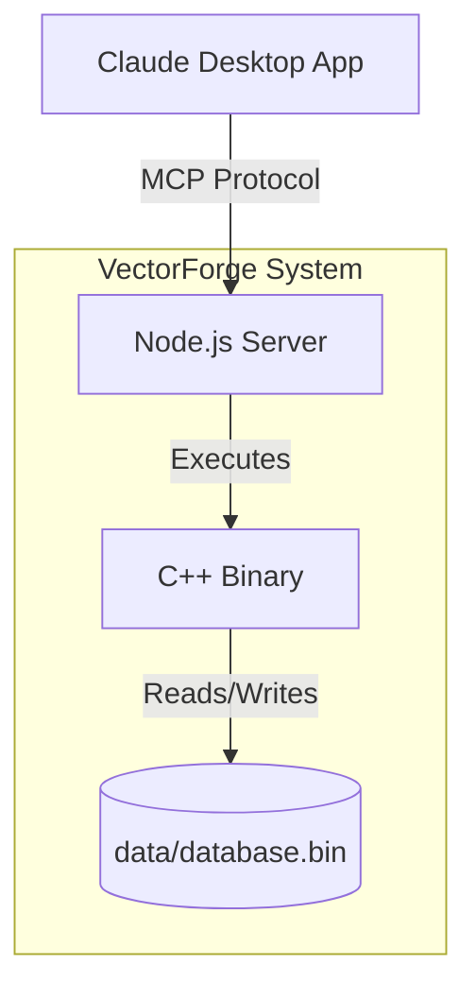

<div align="center">
  
  <h1>VectorForge</h1>
  <p><strong>High-Performance Local Vector Database &amp; C++ MCP Server</strong></p>
  <p>
    <a href="#installation--setup">Installation</a> •
    <a href="#usage-guide">Usage</a> •
    <a href="#error-handling--troubleshooting">Troubleshooting</a> •
    <a href="#architecture">Architecture</a> •
    <a href="#license">License</a>
  </p>
</div>

---

## 🚀 Overview

**VectorForge** is a local RAG (Retrieval-Augmented Generation) system that provides long-term memory for AI assistants (e.g., Claude) by combining a high-performance C++ vector engine with a TypeScript Model Context Protocol (MCP) server.

Key ideas:
- C++ for fast vector operations and compact binary storage.
- Node.js MCP server for integration with Claude and embedding generation.
- Local-only storage (no cloud required).

---

## ✨ Features

- ⚡ C++ Core Engine (C++17, zero external runtime deps)
- 🔌 MCP Integration (Node.js)
- 💾 Local binary storage (`data/database.bin`)
- 🔍 Cosine similarity search
- 🛠️ Extensible embedding backend (OpenAI, Ollama, etc.)

---

## 🏗️ Architecture



- Frontend: Claude sends JSON via MCP.
- Middleware: TypeScript server generates embeddings and forwards requests.
- Backend: C++ binary handles I/O and vector math.

---

## 🛠️ Installation & Setup

### Prerequisites
- g++ (C++17)
- Node.js v18+
- npm
- make

### 1. Clone & Build
```bash
git clone https://github.com/yourusername/VectorForge.git
cd VectorForge
make all
```

### 2. Configure Claude Desktop
Edit Claude config to add the MCP server entry (use absolute path):

MacOS: `~/Library/Application Support/Claude/claude_desktop_config.json`  
Windows: `%APPDATA%/Claude/claude_desktop_config.json`

Below are two helpful images showing where to add the MCP server in Claude Desktop and exactly what to write in the config to connect VectorForge. Place these files in the repository at `images/claude_mcp_location.png` and `images/claude_command_example.png`.

<div align="center">
  
  <p><em>Screenshot: where to add an MCP connector in Claude Desktop settings.</em></p>

  
  <p><em>Screenshot: example JSON entry to add to claude_desktop_config.json.</em></p>
</div>

Example JSON entry (use absolute path to your built server):
```json
{
  "mcpServers": {
    "vectorforge": {
      "command": "node",
      "args": ["/ABSOLUTE/PATH/TO/VectorForge/server/dist/index.js"]
    }
  }
}
```

### 3. Verify
Restart Claude Desktop and confirm the VectorForge connector appears.

---

## 💻 Usage Guide

### With Claude (recommended)
- Store memory: instruct Claude to remember text — triggers `store_memory`, which saves text + embedding to `database.bin`.
- Recall memory: ask Claude — triggers `recall_memory`, which searches `database.bin` using cosine similarity.

### CLI (developer/debug)
Add a vector:
```bash
./build/vectorforge add "This is a test memory" "[0.1, 0.2, 0.3, ...]"
```
Search:
```bash
./build/vectorforge search "[0.1, 0.2, 0.3, ...]"
```

---

## ⚠️ Error Handling & Troubleshooting

### Common Errors

| Error / Symptom | Possible Cause | Solution |
|---|---|---|
| "Error: C++ executable not found" | C++ binary not built | Run `make cpp` or `make all` |
| "Permission denied" (on database.bin) | Server lacks write permission | `chmod -R 755 data/` |
| "MCP Connection Refused" | Incorrect path in config | Use absolute path in `claude_desktop_config.json` |
| "Vector dimension mismatch" | Embedding size != expected (1536) | Ensure embedding model outputs 1536 dims |
| "Failed to open database" | Corrupted or missing .bin | Delete `data/database.bin` (it will be recreated) |

### Debugging steps
1. Check MCP logs (example): `tail -f ~/Library/Logs/Claude/mcp.log`  
2. Run the C++ binary manually: `./build/vectorforge`  
3. Rebuild: `make clean && make all`

---

## 📂 Project Structure
```
VectorForge/
├── cpp/               # C++ source
│   ├── main.cpp
│   └── vector_store*
├── server/            # TypeScript MCP server
│   └── src/index.ts
├── data/              # Binary storage
│   └── database.bin
├── images/            # README assets
│   ├── logo.png
│   ├── claude_mcp_location.png
│   └── claude_command_example.png
└── LICENSE            # License file
```

---

## 🔮 Roadmap
- Replace mock embeddings with OpenAI / Ollama integration
- Add metadata (tags, timestamps)
- Implement HNSW index for large-scale datasets

---

## 📄 License

This project is licensed under the terms of the MIT License. See the [LICENSE](./LICENSE) file for details.

---  
Note: Double-check configuration paths and embedding dimensions before production use.

